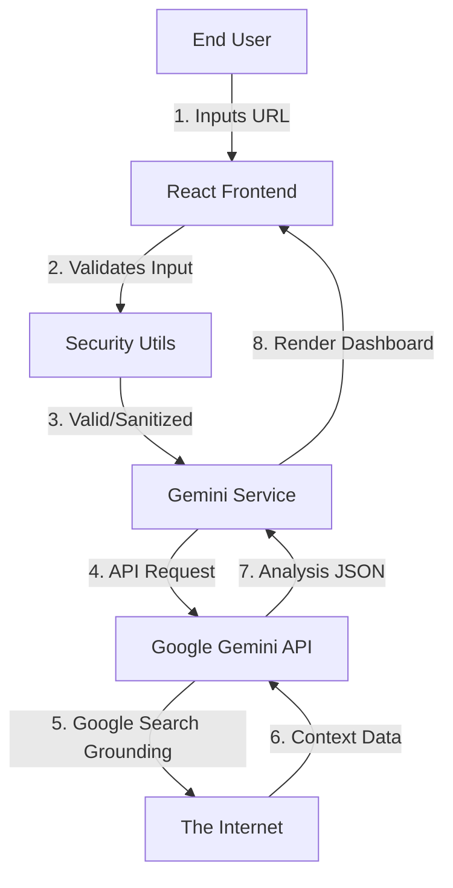

# System Architecture

SecureScout is built as a **Single Page Application (SPA)** with a **Serverless AI Backend**.

## High-Level Overview

## Components

### 1. Frontend Layer (React 19)
*   **App.tsx**: Main controller, handles state management and routing (simulated).
*   **Lazy Loading**: Components like `ReportDashboard` and `ScanningOverlay` are loaded on-demand to improve TTI (Time to Interactive).
*   **Tailwind CSS**: Utility-first styling for responsiveness and Dark Mode.

### 2. Logic Layer (TypeScript Services)
*   **geminiService.ts**: Abstraction layer for Google GenAI SDK. Handles API keys, rate limiting, and response parsing.
*   **promptService.ts**: Responsible for Prompt Engineering. Keeps the prompt logic separate from execution logic.
*   **securityUtils.ts**: Defensive coding layer. Ensures no malicious input reaches the prompt engine.

### 3. AI Layer (Google Cloud)
*   **Model**: `gemini-3-pro-preview` (Reasoning & Report Gen) and `gemini-2.5-flash` (Streaming Chat).
*   **Tools**: `googleSearch` grounding tool is used to fetch live website data (headers, content) without needing a custom web scraper backend.

## Design Decisions

*   **Client-Side Architecture**: Chosen to minimize hosting costs and privacy concerns. By not running a middleware server, we ensure user data stays in their browser.
*   **Direct API Usage**: We use the `@google/genai` SDK directly. In a production enterprise env, this would be proxied, but for the hackathon/demo, it provides the fastest performance.
